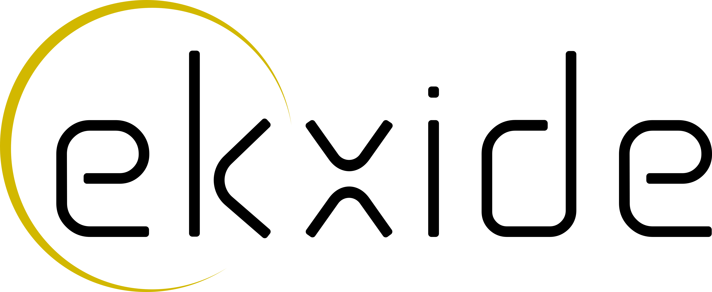

The iceoryx2 Book
=================

.. image:: images/iceoryx-logo-02.png
   :class: hidden
   :alt: iceoryx logo

.. raw:: html

   
   
   

       <!-- Light theme logos -->
       
       
       
       <!-- Dark theme logos -->
       
       
   

Welcome to the ``iceoryx2`` book! Brought to you with ♡ by the developers at
`ekxide IO <http://ekxide.io>`_.

.. toctree::
   :maxdepth: 1
   :caption: User Manual

   introduction

.. toctree::
   :maxdepth: 2

   getting-started/index

.. toctree::
   :maxdepth: 2

   fundamentals/index

.. toctree::
   :maxdepth: 1

   glossary

.. toctree::
   :maxdepth: 1
   :caption: API Reference

   Overview <https://eclipse-iceoryx.github.io/iceoryx2>
   Rust <https://docs.rs/iceoryx2/latest>
   Python <https://eclipse-iceoryx.github.io/iceoryx2/python/latest>
   C++ <https://eclipse-iceoryx.github.io/iceoryx2/cxx/latest>
   C <https://eclipse-iceoryx.github.io/iceoryx2/c/latest>
